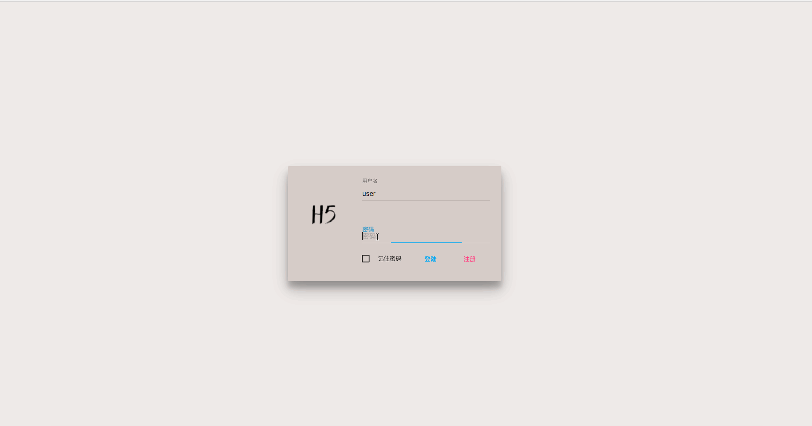
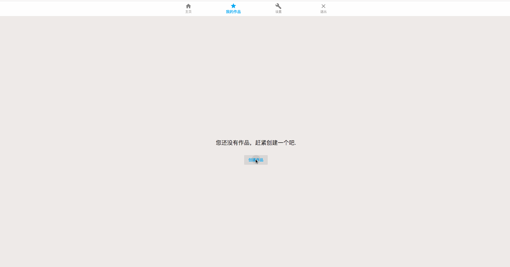
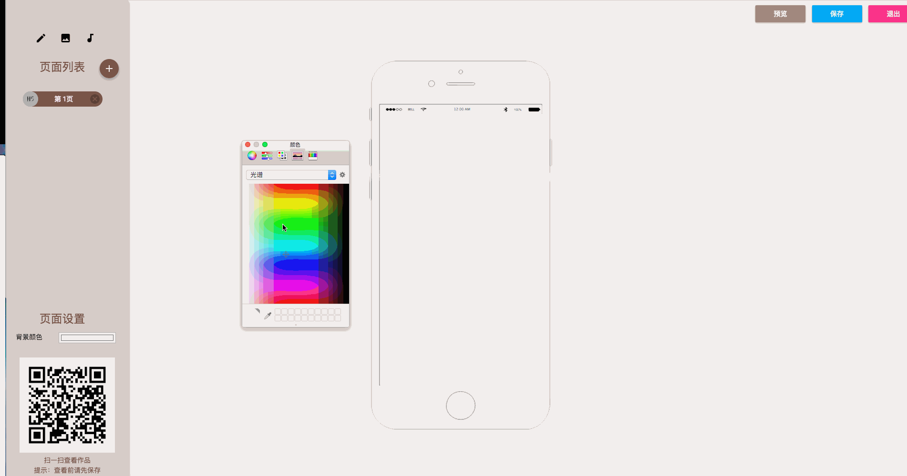
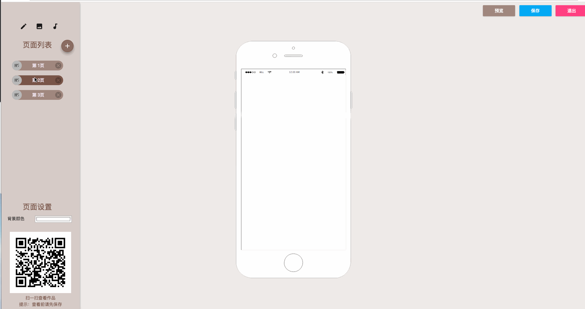
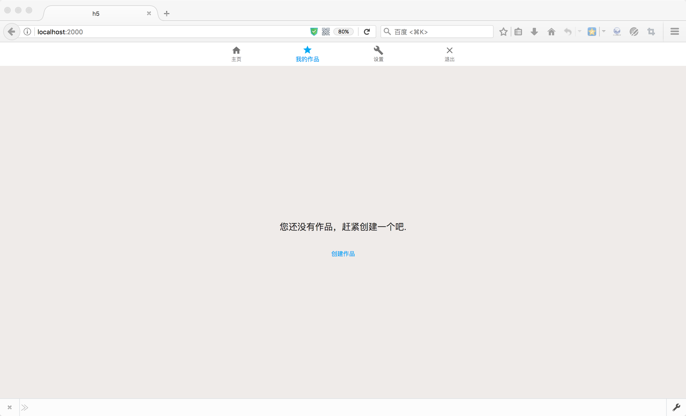
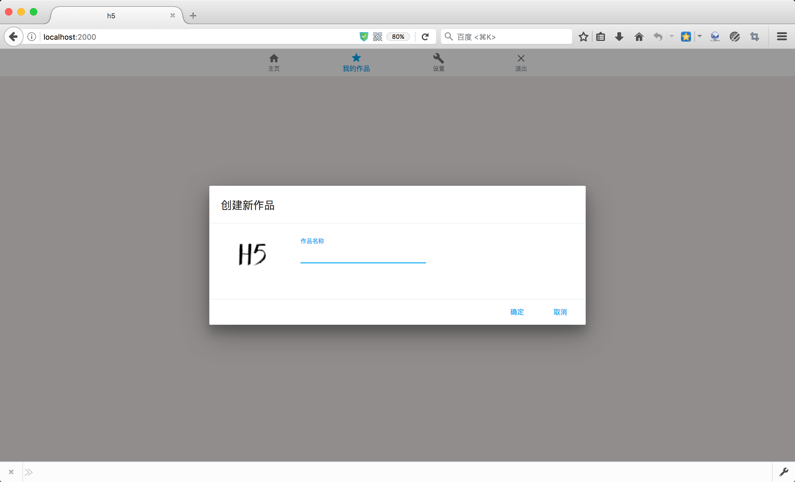
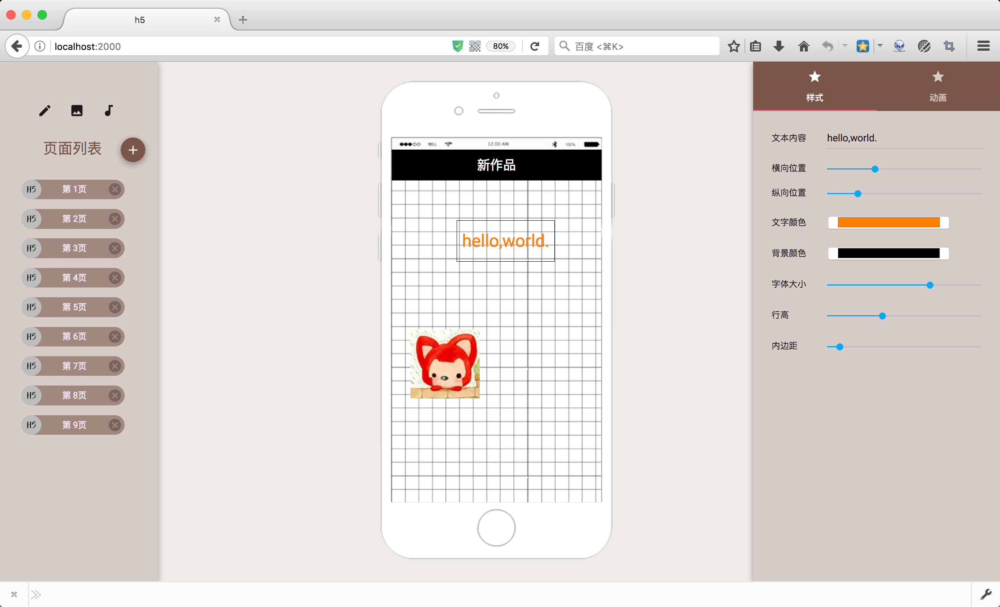
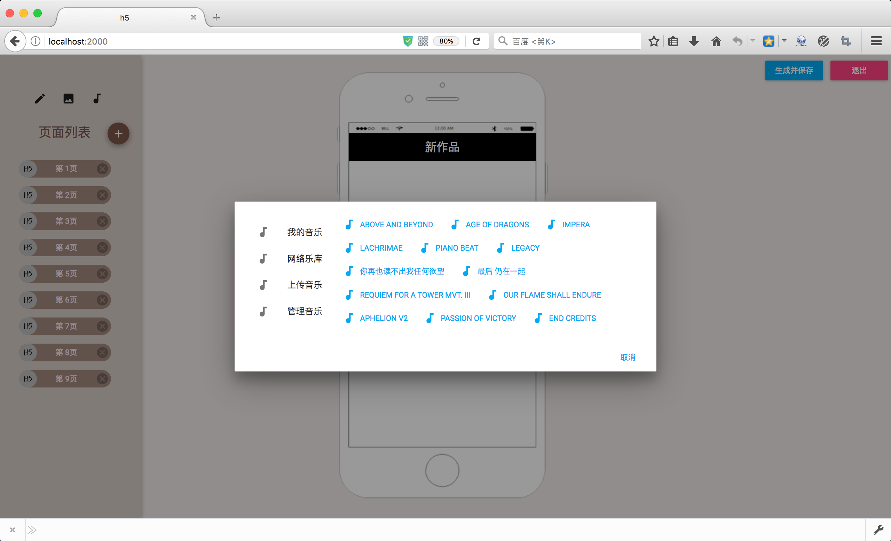

# H5


## 简介

H5是一款可视化编辑手机H5页面的单页应用WebApp，可以根据用户的设计自动产生精美的H5界面。

类似市面上易企秀、简客这样的app。

这是我的个人项目，旨在学习Vue.js以及前后端开发流程。


## 运行

```bash
cd H5

# install dependencies
npm install

# app running
npm start
```


	open localhost:2000


## 技术

前端：Vue.js + Vuex

后端：Node.js

构建：webpack

数据库: MongoDB

UI:  Muse-UI (https://museui.github.io/#/index)


## 目录结构
<pre>
├─  package.json        # 项目配置
├─  README.md           # 项目说明
├─  app.js              # 项目入口文件
├─  images              # 静态图片
├─  userData            # 用户数据
├─  node_modules        # npm依赖包
├─  webpack.config.js   # webpack配置文件
├─  .babelrc            # babel配置
│
│
├─  app                 # node后端业务
      │
      │ controllers     #  控制器
      │ models          #  数据模型
      │ routes          #  路由分发
│
│
├─  bin                 # node启动
│
│
└─  views               # 前端代码
      │ app.js          # 前端页面入口文件
      │ components      # 基础组件
      │ dist            # 编译生成文件
      │ index.html      # 首页
      │ layouts         # 布局
      │ music           # 用户静态音乐
      │ pages           # 根据路由切换页面
      │ routes.js       # 路由表
      │ show.ejs        # ejs模板，用以产生H5页面
      │ static          # 静态html以及css文件
      │ store           # vuex store
│
│
└─  config              # node配置
</pre>
  

## 效果图










   

   

   

   

   


